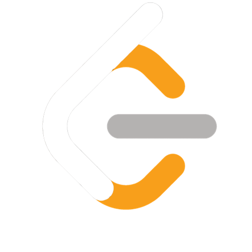

<!-- -->

<h1 align="center">
  
</h1>

<!--<h5 align="center">
  <code><a href="www.linkedin.com/in/tanmoy-shome" title="LinkedIn Profile"> LinkedIn</a></code>
  <code><a href="https://www.kaggle.com/tanmoyshome" title="Kaggle Profile"> Kaggle</a></code>
  <code><a href="https://leetcode.com/u/TanmoyShome/" title="Leetcode Profile"> Leetcode</a></code>
  <code><a href="https://codeforces.com/profile/DebuggingMyLady" title="Codeforece Profile"> Codeforce</a></code>
</h5>-->
 

  I graduated with a Bachelor's in Software Engineering from <a href ="https://daffodilvarsity.edu.bd/">Daffodil International University</a>, Bangladesh. Currently, I’m a Research Assistant at <a href ="https://bengaliai.github.io/">Bengali.AI,</a> where I focus on advancing Bengali Language Technology through innovative algorithms and open-source contributions.
<!--    
  💬 Ask me anything about from <a href="https://github.com/zumrudu-anka/zumrudu-anka/issues" title="Issues">Here</a> -->
   
<!--   📫 How to reach me: <a href="mailto: osmandurdag@hotmail.com">osmandurdag@hotmail.com</a> -->

 

<h2 align="left"> Research Interest: </h2>

  
 **I am open to**:

- Any collaboration research which align my Research Interest.
- Machine learning projects(Development or Research) 
- <b>Work for AI/ML Engineer/Research Assistant position.</b>

## Skills:

#### Languages:

#### ML Libraries

#### ML framework

#### ML Practices & Techniques

#### Web Frameworks

#### Database

#### OS & Version Control

&nbsp;
&nbsp;

<!-- &nbsp;
&nbsp; -->

#### Dev Tools

&nbsp;
&nbsp;

&nbsp;

## Connect with me:

 

 

<h2 align="center">⚡ Stats ⚡</h2>
 

  

    
    
  

           
  

    
  

   

  

<h2 align="center">👨‍💻 Repositories 👨‍💻</h2>
 

  

      

  
  

      

  
  

      

<h4 align="center">
  <a href="https://github.com/zumrudu-anka?tab=repositories" title="Show Repositories">🔎 Show More 🔍</a>
</h4>

<!--
**zumrudu-anka/zumrudu-anka** is a ✨ _special_ ✨ repository because its `README.md` (this file) appears on your GitHub profile.

Here are some ideas to get you started:

- 🔭 I’m currently working on ...
- 🌱 I’m currently learning ...
- 👯 I’m looking to collaborate on ...
- 🤔 I’m looking for help with ...
- 💬 Ask me about ...
- 📫 How to reach me: ...
- 😄 Pronouns: ...
- ⚡ Fun fact: ...

Notes: If you want use this readme, firstly star it please. If you can't align your repositories like this, please change your repository desription to shorter than now. Maybe 4 or 5 word will be good.

-->
